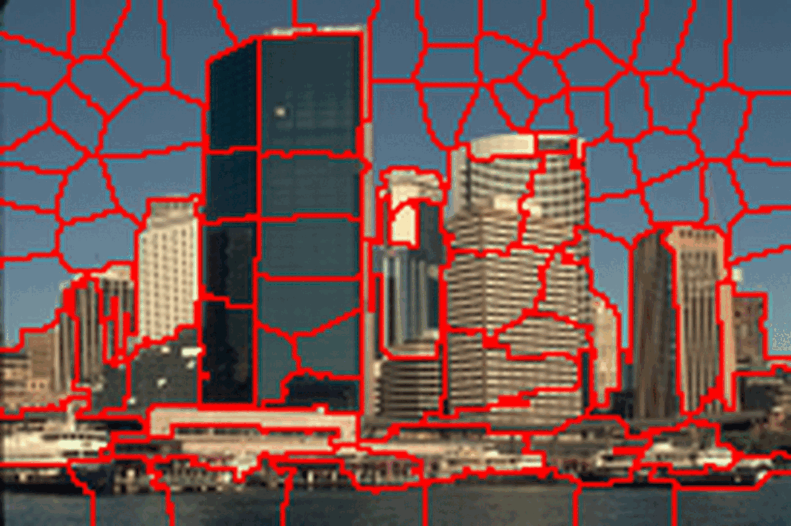
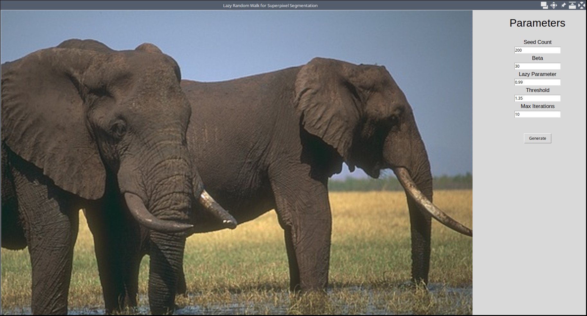
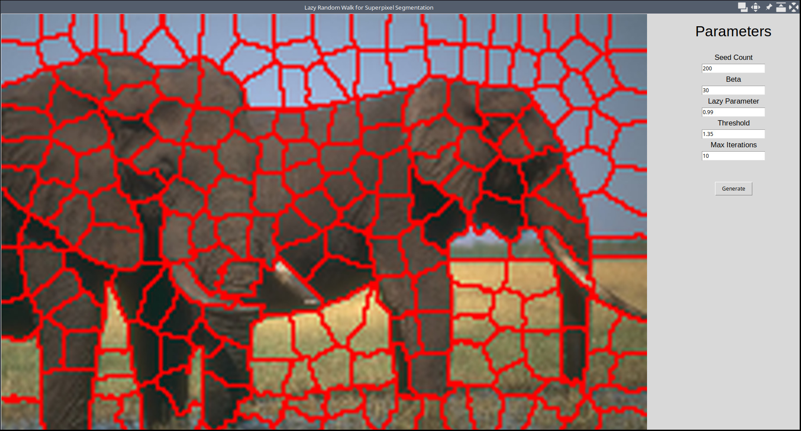
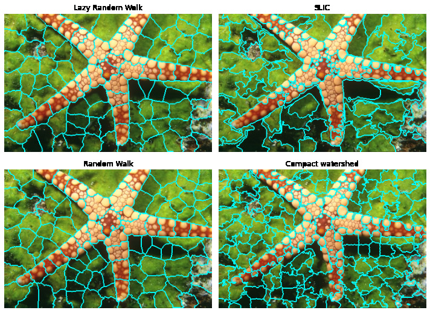

# Lazy Random Walks for Superpixel Segmentation

[](https://www.python.org/)
[](https://github.com/psf/black)

## Table of contents

- [Lazy Random Walks for Superpixel Segmentation](#lazy-random-walks-for-superpixel-segmentation)
  - [Parameters](#parameters)
  - [Results](#results)
  - [Installation](#installation)
  - [Repository Structure](#repository-structure)

This repository contains a python implementation of the paper [Lazy Random Walks for Superpixel Segmentation](https://ieeexplore.ieee.org/document/6725608). The repository provides a minimal GUI built using the [Tkinter](https://docs.python.org/3/library/tkinter.html) library. The GUI exposes various parameters which can be used to tweak the quality of the results obtained. A brief overview of all the parameters and their usage has been given below. For more details about them please refer to the original paper.

<figure>
  <div style="display: flex; justify-content: center">
    
  </div>
  <figcaption style="text-align:center">Iterative process of LRW followed by energy optimisation</figcaption>
</figure>

## Parameters

- **Seed Count**: The seed count refers to the total number of superpixels we want to have in the final image.

- **Beta**: Beta is the Gaussian parameter. It dictates how much the intensity difference between neighbouring pixels affects the result.

- **Lazy Parameter**: Lazy parameter is the probability with which the random walk algorithm leaves the node it currently is on. That is it stays on the same node with probability  where  is the lazy parameter.

- **Threshold**: Threshold is the value of area after which a split in a superpixel will happen. The area function used in the paper is the [Local Binary Pattern](https://en.wikipedia.org/wiki/Local_binary_patterns) function which effectively measures the texture content of a region.

- **Max Iterations**: Max iterations refer to the maximum number of times the LRW and area optimisation algorithm will be run.

<figure>
  <div style="display: flex; justify-content: space-around">
    
    
  </div>
  <figcaption style="text-align:center">Screenshots of the GUI</figcaption>
</figure>

## Results

We ran our algorithm on the [Berkely Segmentation Dataset (BSDS300)](https://www2.eecs.berkeley.edu/Research/Projects/CS/vision/bsds/) and have provided the results in a [OneDrive folder](https://iiitaphyd-my.sharepoint.com/:f:/g/personal/dipanwita_g_research_iiit_ac_in/Eiz_Qq3-QR1HhCxKDPsJu1EBKhNC-0FcZHheM0m6dKpSCw?e=TUX3rb). We also performed qualitative and quantitative comparisons of our algorithm with several other well known algorithms such as Random Walk, Compact Watershed and SLIC.

<figure>
  <div style="display: flex; justify-content: space-around">
    
  </div>
  <figcaption style="text-align:center">Qualitative comparison of various algorithms</figcaption>
</figure>

## Installation

To run the GUI, first install the python dependencies defined in [requirements.txt](./requirements.txt) using:

```bash
pip install -r requirements.txt
```

Alternatively if you use NixOS or the Nix package manager you can easily enter a shell provisioned with the needed dependencies using:

```bash
nix-shell
```

Once the dependencies have been installed you can run the GUI using:

```bash
python main.py
```

## Repository Structure

```
.
├── benchmark.ipynb     (Notebook containing benchmarks and comparisons with other algorithms)
├── experiments.ipynb   (Notebook containing experiments performed on hyperparameters)
├── images              (Directory containing all the images used)
├── main.py             (Entrypoint for the GUI)
├── media               (Media files neeeded for the repository and presentation)
├── README.md
├── requirements.txt    (PyPi Dependancies)
├── shell.nix           (Nix Dependancies)
└── src
    ├── dataset_test.py (Code for testing on BSDS300)
    ├── lrw.py          (Code containing the main algorithm)
    └── utils.py        (Commonly needed utility functions)
```
